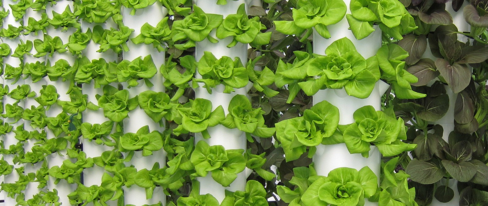

<p align="center">
  
</p>

<p align="center"><em>Fighting hunger and pollution with sustainable aeroponics.</em></p>

# 🌿 BU Aeroponics Project

**Vertical Aeroponics at Boston University**  
A Campus Climate Lab–funded research initiative in collaboration with the Institute for Global Sustainability.  
Our team explores how small, community-integrated aeroponic towers can reduce emissions, conserve water, and improve access to fresh food.

[](https://lpalmer23.github.io/aeroponics-website)


## Overview
This website highlights our research, installations, and community partnerships.  
We study why many large vertical farming ventures failed and test how smaller, energy-efficient systems can succeed in existing infrastructure.

**Key features**
- Research, partner, and volunteer pages  
- Visuals showing tower data and plant growth  
- Accessible, mobile-friendly design  

## Tech Stack
React · Vite · Tailwind CSS · GitHub Pages  
Optional: Recharts for data visuals · Leaflet for maps

## Local Setup
```bash
git clone https://github.com/LPalmer23/aeroponics-website.git
cd aeroponics-website
npm install
npm run dev 
```

## License
This project is licensed under the **MIT License**.  
See the [LICENSE](./LICENSE) file for details.


